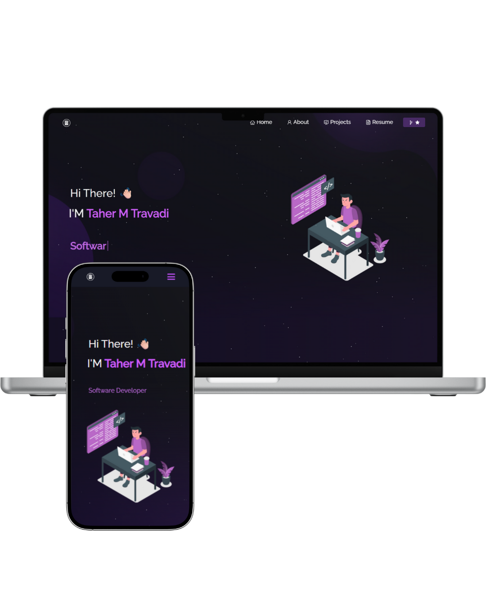
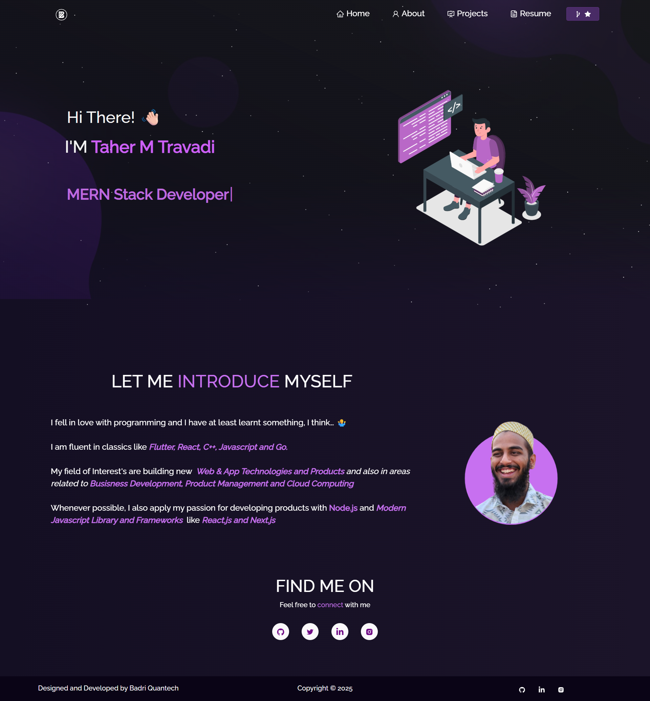
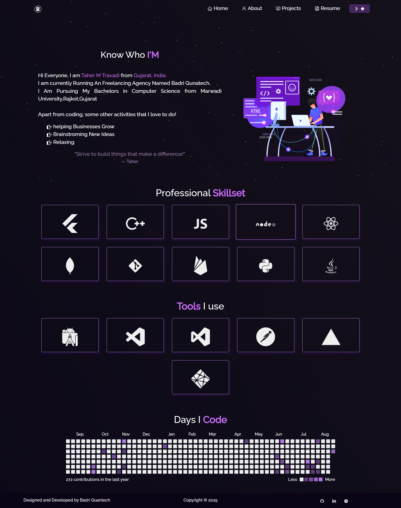
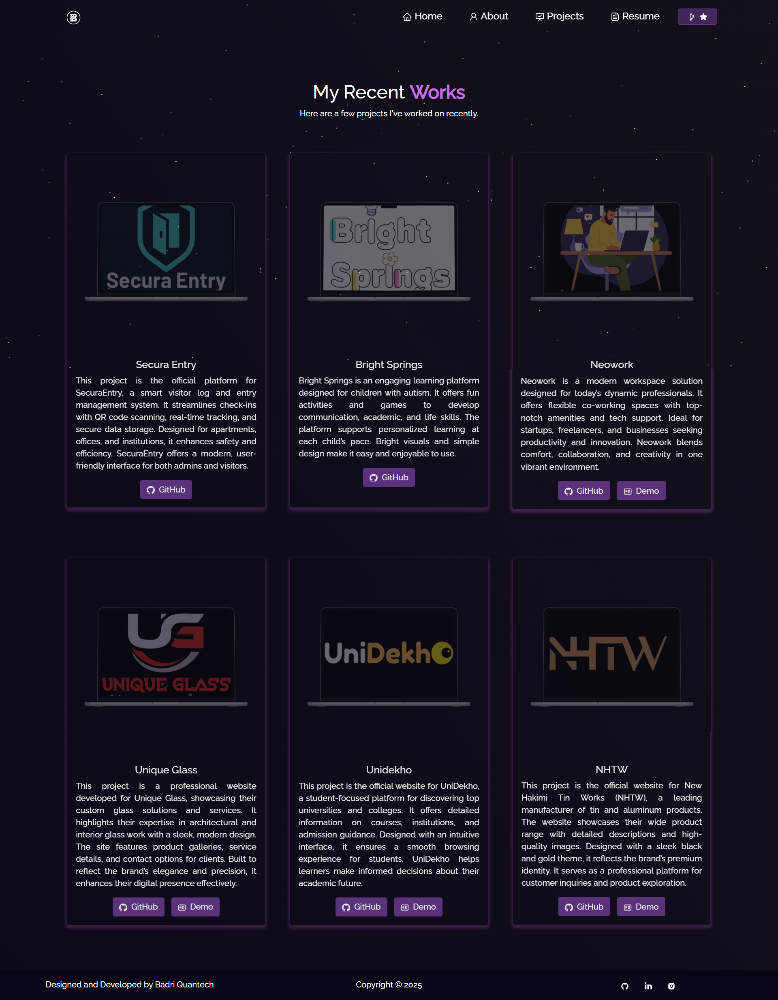
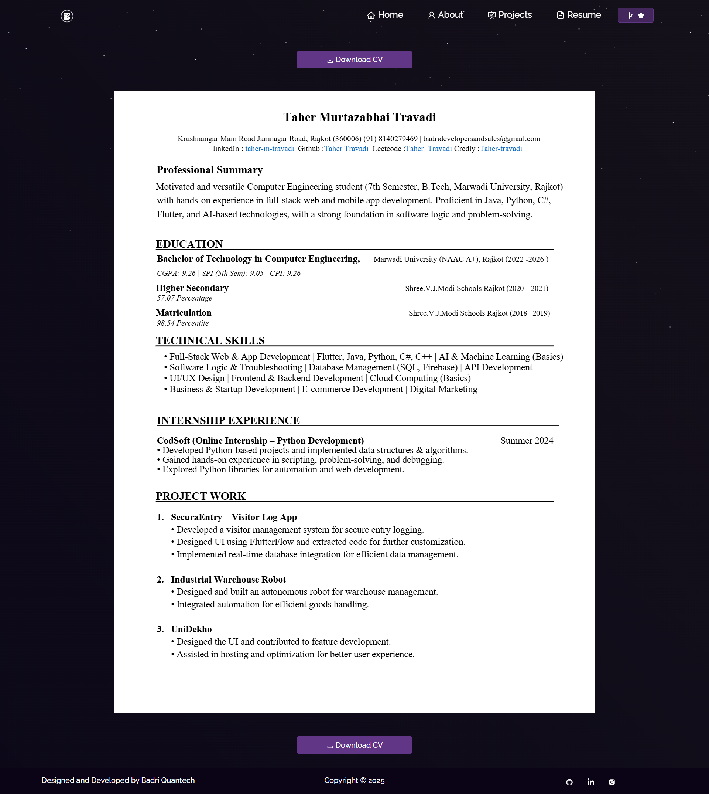

# Taher M Travadi - Portfolio Website 💻✨  

A modern portfolio website built with the **MERN stack** to showcase my skills, projects, achievements, and professional journey as a developer and entrepreneur.  
The website highlights my experience in **web development, app development, AI/ML, and open-source contributions**.  

🔗 Live Website: [https://taher-travadi-portfolio.vercel.app/](https://taher-travadi-portfolio.vercel.app/)  

---

## 📖 About the Project  
This portfolio is my **digital identity** where I showcase my technical skills, professional projects, entrepreneurial ventures, and achievements.  
It is fully responsive, interactive, and designed with a clean, modern UI.  

The site not only serves as a **resume** but also acts as a **project hub** with links to my open-source contributions and live demos.  

---

## ✨ Features  
- 🖥️ **Modern MERN Stack** – Built with React frontend and Node/Express backend.  
- 📌 **Projects Showcase** – Highlighting professional work, startups, and personal projects.  
- 📜 **About Me Section** – Education, skills, and career journey.  
- 📂 **Resume Download Option** – Direct access to my resume.  
- ✨ **Animations & Transitions** – Smooth UI for engaging experience.  
- 📱 **Responsive Design** – Optimized for all devices.  
- 🌍 **SEO Friendly** – Indexed and optimized for discoverability.  

---

## 🛠️ Tech Stack  
- **Frontend:** React.js  
- **Backend:** Node.js + Express  
- **Database:** MongoDB  
- **Styling:** CSS, Bootstrap, Framer Motion (if used, confirm)  
- **Deployment:** Vercel  
- **Version Control:** Git & GitHub  

---

## 📷 Screenshots  

   

- **Homepage**  
    

- **About Section**  
    

- **Projects Section**  
    

- **Resume Section**  
    

---

## 🚀 Deployment  
The website is deployed on **Vercel**.  

🔗 Live Demo: [https://taher-travadi-portfolio.vercel.app/](https://taher-travadi-portfolio.vercel.app/)  

Run locally:  
```bash
# Clone the repository
git clone https://github.com/mercyless22/portfolio-mern.git

# Navigate into folder
cd src

# Install dependencies
npm install

# Run the app
npm start
````

---

## 📌 Future Scope

* ✅ Add **dark/light mode toggle**.
* ✅ Build a **blog section** powered by MongoDB.
* ✅ Create a **dashboard CMS** to update portfolio content dynamically.
* ✅ Add **visitor analytics tracking**.
* ✅ Enhance SEO with structured metadata.
* ✅ Deploy backend separately on **Render/Heroku** for better scalability.

---

## 🤝 Credits

* **Design & Development:** Taher M Travadi ([mercyless22](https://github.com/mercyless22))

---

## 📜 License

This project is licensed under the **MIT License** – free to use and modify with attribution.

---

⭐️ Developed by [Taher M Travadi](https://github.com/mercyless22) with ❤️
